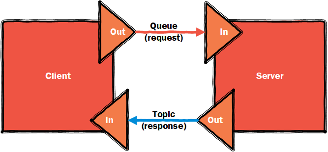

<table>
<tr>
<td width="80%"><a href="../../../README.md"></a></td>
<td width = "*" align="right"></td>
</tr>
</table>

# The 15 minute Microservice

Xigadee is designed to simplify the construction of a Microservice application. It does this by doing much of the heavy lifting regarding communication, task scheduling, logging etc, which allows you to concentrate on just the code and application logic that you need for your application.

This example gives a quick introduction to building a Microservice based application using the Xigadee framework.
For this example, we'll host an API service within a console application. 
We'll construct an API based Microservice that can persist an entity, 
using Create, Read, Update and Delete (CRUD) operations in memory through a simple set of RESTful API call.

First we are going to create a new console application and to this application add the Xigadee [NuGet](https://packages.nuget.org/packages/Xigadee) library to you project and add the following line in the _using_ section.
```C#
using Xigadee;
```
This server will be our back end server that receives requests from a front-end API service.

The Xigadee libraries are built using Microsoft's .NET technology, and have specific accelerators to target Platform-as-a-Service (PaaS) technologies in the Azure stack.

All the libraries utilise a simple declarative programming model to aid in the construction of the Microservice. 

A quick sample of code from [this](Src/Test/Test.Xigadee/Samples/PersistenceLocal.cs) unit test shows how a Microservice can be quickly constructed within a few lines of code. This code can be found in the '_PersistenceSingle_' method:
```C#
PersistenceClient<Guid, Sample1> repo;

var p1 = new MicroservicePipeline("Local")
    .AddChannelIncoming("request")
        .AttachPersistenceManagerHandlerMemory(
              keyMaker: (Sample1 e) => e.Id
            , keyDeserializer: (s) => new Guid(s)
            , versionPolicy: ((e) => e.VersionId.ToString("N").ToUpperInvariant(), (e) => e.VersionId = Guid.NewGuid(), true)
        )
        .AttachPersistenceClient(out repo)
    .Revert()
    ;

p1.Start();

var sample = new Sample1() { Message = "Hello mom" };
var id = sample.Id;
//Run a set of simple version entity tests.
//Create
Assert.IsTrue(repo.Create(sample).Result.IsSuccess);
//Read
var result = repo.Read(id).Result;
Assert.IsTrue(result.IsSuccess);
Assert.IsTrue(result.Entity.Message == "Hello mom");
```
This service creates a quick memory-based entity store for the POCO class, Sample1, that supports CRUD (Create/Read/Update/Delete) functions for the entity, with optimistic locking, and additional versioning and search methods, based on a key field (Id) and optional version field (VersionId) defined in the entity. 

If we were to use the [Xigadee Azure](Src/Xigadee.Azure/_docs/Introduction.md) library, we could replace the following method:
```C#
.AttachPersistenceManagerHandlerMemory(
```
with this method, which would switch it to use a DocumentDb (now CosmosDb) backed entity store:
```C#
.AttachPersistenceManagerDocumentDbSdk(
```                       
or this method to use a Azure Blob Storage collection instead:
 ```C#
.AttachPersistenceManagerAzureBlobStorage(
```
### Refactoring
As mentioned earlier, Xigadee is designed to allow quick rapid application development, through easy refactoring of its pipeline based code. Below we have broken the initial Microservice in to two independent services (_PersistenceClientServer_ method on the [same test class](Src/Test/Test.Xigadee/Samples/PersistenceLocal.cs)), and connected the services together using a manual communication bridge. 
 ```C#
//Create an internal test communication bridge
var fabric = new ManualFabricBridge();
var bridgeRequest = new ManualCommunicationBridgeAgent(fabric, CommunicationBridgeMode.RoundRobin);
var bridgeResponse = new ManualCommunicationBridgeAgent(fabric, CommunicationBridgeMode.Broadcast);

PersistenceClient<Guid, Sample1> repo;

var p1 = new MicroservicePipeline("Server")
    .AddChannelIncoming("request")
        .AttachPersistenceManagerHandlerMemory(
              keyMaker: (Sample1 e) => e.Id
            , keyDeserializer: (s) => new Guid(s)
            , versionPolicy: ((e) => e.VersionId.ToString("N").ToUpperInvariant(), (e) => e.VersionId = Guid.NewGuid(), true)
            )
        .AttachListener(bridgeRequest.GetListener())
        .Revert()
    .AddChannelOutgoing("response")
        .AttachSender(bridgeResponse.GetSender())
        ;

var p2 = new MicroservicePipeline("Client")
    .AddChannelIncoming("response")
        .AttachListener(bridgeResponse.GetListener())
        .Revert()
    .AddChannelOutgoing("request")
        .AttachSender(bridgeRequest.GetSender())
        .AttachPersistenceClient("response",out repo)
        .Revert()
        ;

p1.Start();
p2.Start();
 ```
 The same unit tests can be run, but the system is now functioning as two independent services. These can now be split in to separate executables and run independently. We now need a reliable form of communication between the two services to deliver the messages being sent between them.
### Communication

The [Xigadee Azure](Src/Xigadee.Azure/_docs/Introduction.md) libraries contain specific accelerators for the Azure Service Bus that can be simply applied to a Microservice pipeline.

The Azure Service Bus can be used to connect the two Microservice, like this:



There are a items that are worth noting in more detail. Firstly we use a Service Bus Queue for the request channel, and a Service Bus Topic for the response channel. 
 ```C#
//Either use a .runsettings file to set this value 'CI_ServiceBusConnection' or just manually set the value 
//here if you want to run the test.
var sbConnection = TestContext.GetCISettingAsString(AzureConfigShortcut.ServiceBusConnection.ToSettingKey());

PersistenceClient <Guid, Sample1> repo;

var p1 = new MicroservicePipeline("Server")
    .AzureConfigurationOverrideSet(AzureConfigShortcut.ServiceBusConnection, sbConnection)
    .AddChannelIncoming("request")
        .AttachPersistenceManagerHandlerMemory(
              keyMaker: (Sample1 e) => e.Id
            , keyDeserializer: (s) => new Guid(s)
            , versionPolicy: ((e) => e.VersionId.ToString("N").ToUpperInvariant(), (e) => e.VersionId = Guid.NewGuid(), true)
            )
        .AttachAzureServiceBusQueueListener()
        .Revert()
    .AddChannelOutgoing("response")
        .AttachAzureServiceBusTopicSender()
        ;

var p2 = new MicroservicePipeline("Client")
    .AzureConfigurationOverrideSet(AzureConfigShortcut.ServiceBusConnection, sbConnection)
    .AddChannelIncoming("response")
        .AttachAzureServiceBusTopicListener()
        .Revert()
    .AddChannelOutgoing("request")
        .AttachAzureServiceBusQueueSender()
        .AttachPersistenceClient("response",out repo)
        .Revert()
        ;

p1.Start();
p2.Start();
  ```

Here we have replaced the manual communication bridge with a Service Bus communication.

<table><tr> 
<td><a href="http://www.hitachiconsulting.com"></a></td> 
  <td>Created by: <a href="http://github.com/paulstancer">Paul Stancer</a></td>
  <td><a href="../../../README.md">Home</a></td>
</tr></table>
