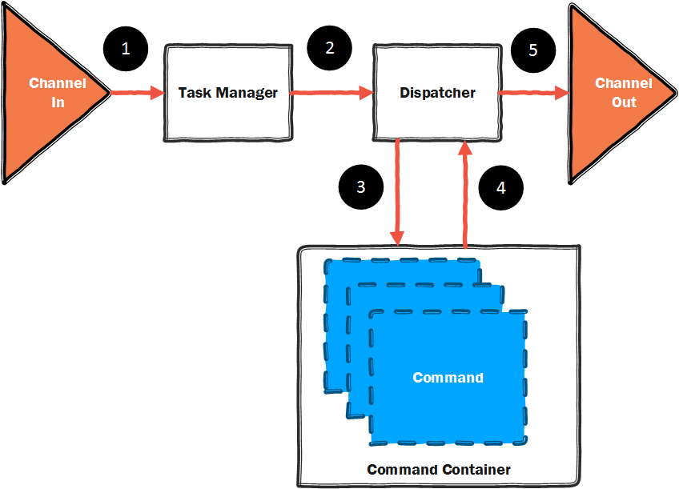

<table>
<tr>
<td width="80%"></td>
<td width = "*" align="right"></td>
</tr>
</table>

# Xigadee library - an introduction

Xigadee is an extensible Microservice framework that can be used to build modern scalable applications using Platform-As-A-Service technologies.

It is made up of a number of key components. In this section, I will outline the basic building blocks of a Xigadee Microservice, and explain how you can use them to build your application.

## The message flow

Xigadee works as a message processing system. Messages are passed between the Microservices throough the channels. Once a message is received by a Microservice, it will be routed to the relevant command object through the path documented below.

1. Message arrives
2. Message is assigned an execution slot
3. Messages is passed to the Dispatcher and matched against the relevant commands
4. Response is received and is passed to the relevant channel
5. Response message is transmitted.

### The channels

### Asynchronous messaging

### Synchronous messaging

## The command object

### Policy

### Statistics

### The types of command

#### Persistence

#### Master Jobs

#### Command Initiators

## Serialization

## Security

## The configuration pipeline

Xigadee uses a declarative programming model which simplifies the setup of a Microservice within it's container.

## Next: [15 Minute Microservice](fifteenminuteMicroservice.md)

<table><tr> 
<td></td> 
<td>Created by: <a href="http://github.com/paulstancer">Paul Stancer</a></td>
  <td><a href="https://www.nuget.org/packages/Xigadee">NuGet Package</a></td>
  <td><a href="../../README.md">Home</a></td>
</tr></table>
