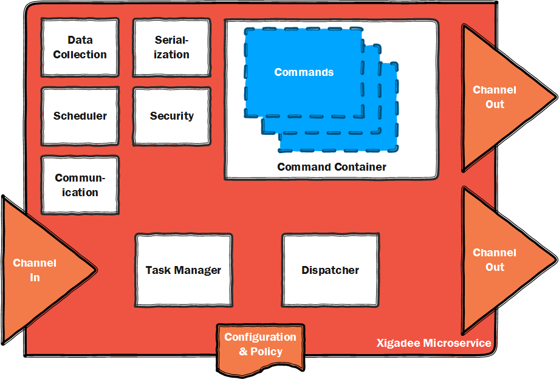

<table>
<tr>
<td width="80%"></td>
<td width = "*" align="right"></td>
</tr>
</table>

# Xigadee library - an introduction

Xigadee is an extensible Microservice framework that can be used to build modern scalable applications using Platform-As-A-Service technologies.

It is made up of a number of key components. In this section, I will outline the basic building blocks of a Xigadee Microservice, and explain how you can use them to build your application.

## The message flow

### The channels

### Asyncronous messaging

### Syncronous messaging

## The command object

### Policy

### Statistics

### The types of command

#### Persistence

#### Master Jobs

#### Command Initiators

## Serialization

## Security

## The configuration pipeline

Xigadee uses a declarative programming model which simplifies the setup of a Microservice within it's container.

## Next: [15 Minute Microservice](fifteenminuteMicroservice.md)

<table><tr> 
  <td></td> 
  <td>Posted by: <a href="http://github.com/paulstancer">Paul Stancer</a></td>
  <td><a href="https://www.nuget.org/packages/Xigadee">NuGet Package</a></td>
  <td><a href="../../README.md">Back</a></td>
</tr></table>
