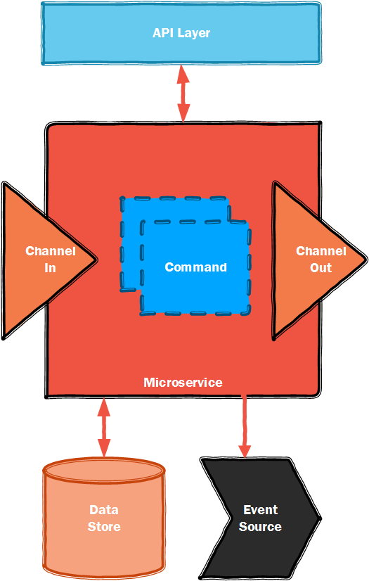

<table>
<tr>
<td width="80%"></td>
<td width = "*" align="right"></td>
</tr>
</table>

# What is a Microservice?

Microservices are a relatively new concept that change the way in how we design and build software systems. They are essentially small autonomous services that work together to form an overall solution.

Instead of designing your application as one big tightly coupled system, we break it down in to smaller composable piece, that can be designed, tested, and deployed independently from each other. 

In general Microservices have the following properties:

1. **Complete and Minimal**
	- A Microservice should deliver a small - but complete - set of business capability. 
	An example of this would be an eCommerce solution, where we create a Customer Microservice that encapsulated the management of a customer's details. Another Microservice would be created to handle the purchases for that customer.
	Basically, a Microservice should do one job well, not a multitude of disparate unrelated tasks. In a sense this is similar to the [Single Responsibility Principle](https://en.wikipedia.org/wiki/Single_responsibility_principle) for software development, but on a slightly larger scale.
	A Microservice should have the ability to be independently updated without affecting the rest of the application.	
2. **Scalable and Elastic**
	- Generally when the load on a particular service increases, the technology that implements the service allows it to scale-out to multiple instances to handle this additional load. Using Microservices, we can scale just the Microservices that are under heavy load. This is especially important for systems that have different operating characteristics over time, i.e. night time batch loads are different to daytime loads. This way we don't have to plan for the maximum possible throughput, but can be more flexible and adjust our capability when required.
3. **Resilient**
	- Microservices based applications should design for failure, specifically where a Microservice is temporarily unavailable. The overall system and should be eventually consistent.
4. **Composable**
	- One of the key benefits of using Microservices, is that it allows for the reuse of the Microservice in other applications or services. We are building a capability that can be consumed when needed, i.e. a Customer Microservice. How we consolidate that service in to the application can be changed and adjusted over time. We now have a Customer capability, but we are open to integrate that in to other applications as our needs change, without the worry of breaking existing functionality as this service is not tightly coupled in to a specific business function.

## How is that different from before?

The [Monolith](https://en.wikipedia.org/wiki/Monolithic_application).

## The Gotcha law!

It's important to understand [CAP Theorem](https://en.wikipedia.org/wiki/CAP_theorem) when building a Microservice based application. If you don't them things can get very complicated and messy, very fast. 

## The Xigadee approach to Microservices

Xigadee has been built from experience. Many of the problems that we have faced building commercial enterprise-grade Microservice based solutions have been incorporated in to the Xigadee framework. Build these types of application, particularly in a PASS based environment, have particular challenges especially ensuring that your solution is fault tolerant. Xigadee solves many of those challenges for you.

## Next: [Introduction To Xigadee](Introduction.md)

##### Footnote, thanks & further reading

 - [Mr Fowler](https://martinfowler.com/articles/microservices.html)
 - [Nirmata](http://www.nirmata.com/2015/02/microservices-five-architectural-constraints/)

<table><tr> 
<td></td> 
<td>Created by: <a href="http://github.com/paulstancer">Paul Stancer</a></td>
  <td><a href="../../README.md">Home</a></td>
</tr></table>
